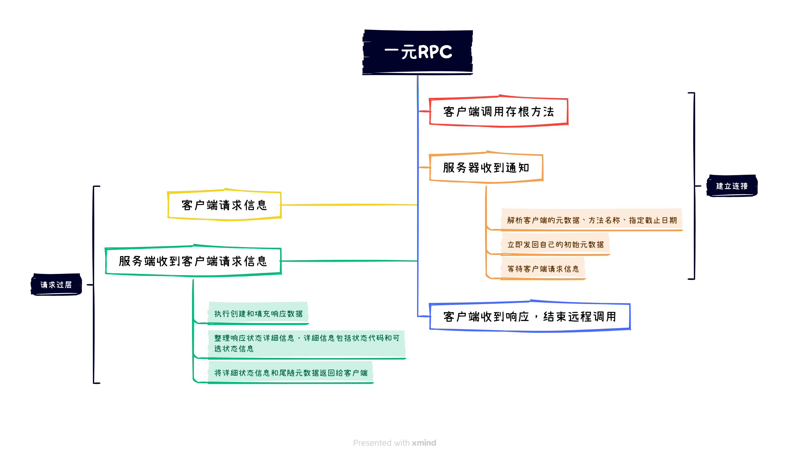
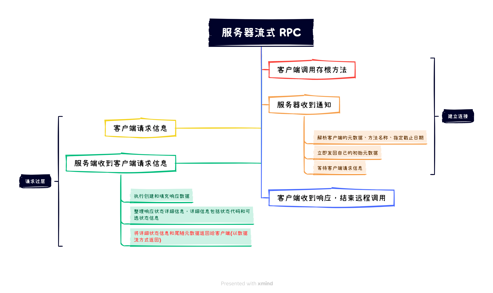
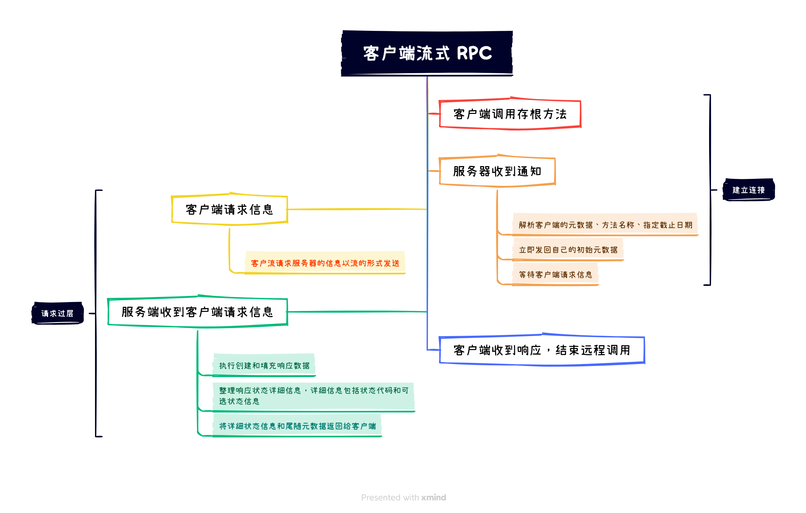
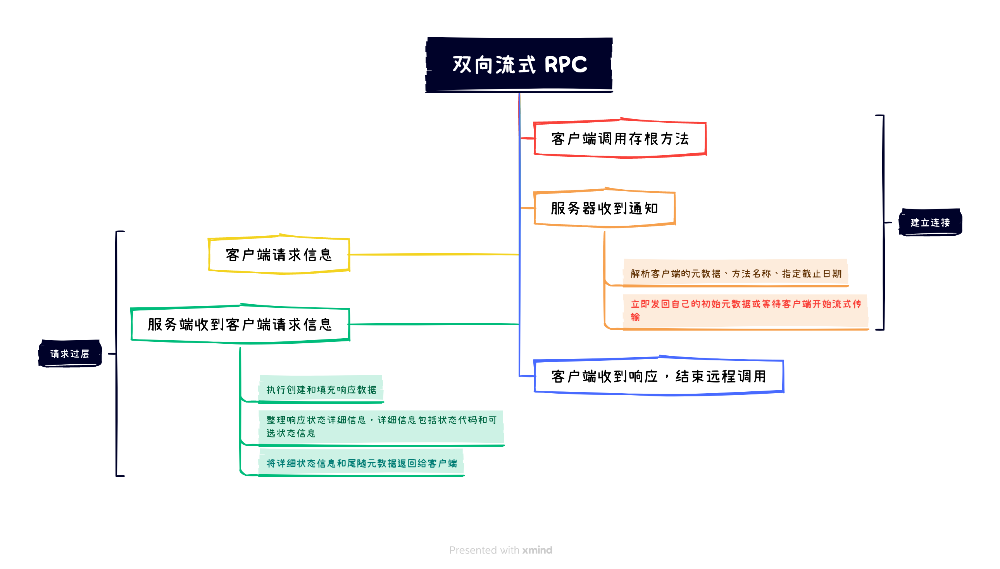

# GRPC使用
```
参考博客
 https://blog.csdn.net/an_gentle_killer/article/details/123282801
 http://doc.oschina.net/grpc
 https://grpc.io/docs/what-is-grpc/introduction/
 https://protobuf.dev/overview/
```
## RPC介绍
RPC（Remote Procedure Call）是一种编程模型，它允许程序在网络中的一台计算机（客户机）上调用另一台计算机（服务器）上的过程或方法，就好像调用本地的过程或方法一样。RPC 抽象掉了底层的网络通信细节，使得开发者可以像编写本地程序一样编写分布式程序。

RPC的主要目标是让构建分布式计算（应用程序）变得简单。在RPC系统中，客户端进程可以调用服务器进程中的过程，就像在本地计算机上调用过程一样。当客户端调用远程过程时，客户端的执行被挂起，参数（如果有的话）通过网络发送到服务器，服务器执行请求的过程，将结果发送回客户端，然后客户端继续执行。

这种模型有很多优点，例如，它可以让开发者使用他们熟悉的语言和工具来编写分布式程序，可以使代码更简洁，更易于理解和维护。但是，它也有一些缺点，例如，它隐藏了网络通信的细节，这可能导致一些难以预见的问题，例如网络延迟，连接中断等。
## GRPC介绍
gRPC（Google Remote Procedure Call）是一种高性能、开源和通用的 RPC（远程过程调用）框架，Google 公司发起并开源。gRPC 的目标是使各种环境中的服务能够相互通信。gRPC 提供了一个简单的方法，让客户端应用可以直接调用另一台服务器上的方法，就好像是本地对象的方法一样。

<span style="color:red;">在服务器端，服务器实现这个接口并运行一个gRPC服务器来处理客户端调用。在客户端，客户端有一个存根（在某些语言中简称为客户端），它提供与服务器相同的方法。</span>

以下是 gRPC 出现的原因和主要特性：

1.多语言支持：gRPC 支持多种语言，如 Go、Python、Java、C++ 等，使开发者可以在他们熟悉的编程环境中开发应用程序。

2.性能：gRPC 基于 HTTP/2，支持双向流、流控制、头部压缩、多路复用等特性。相比于基于 HTTP/1.1 的 RESTful API，gRPC 有更高的性能和更低的延迟。

3.编码效率：gRPC 默认使用 Protocol Buffers 作为接口定义语言，该语言能够自动生成客户端和服务器代码。相比 JSON 和 XML，Protocol Buffers 的编码和解码效率更高，数据更小。

4.连续性和可扩展性：在分布式系统中，gRPC 能够支持客户端和服务器之间的稳定、可靠和低延迟的双向通信。同时，gRPC 也支持连接数的扩展。

5.强大的生态系统：由于是 Google 的开源项目，gRPC 享有强大的生态系统和社区支持，这对于项目的持续改进和问题的解决具有很大的帮助。

因此，gRPC 的出现主要是为了满足现代分布式系统中的高效、跨语言、稳定和可扩展的通信需求。

- 双向流
  双向流是一种网络通信模型，其中客户端和服务器可以在任何时刻都可以发送数据，即数据可以在两个方向上流动。这种模型在很多网络协议中都有应用，包括 HTTP/2、WebSocket、gRPC 等。

  `双向流的好处`：

    - `性能`：在一些场景中，双向流可以提高性能，因为它们可以减少网络延迟。如果客户端和服务器都可以随时发送数据，那么当他们有数据要发送时，就不需要等待对方的响应。
    - `灵活性`：双向流为应用提供了更大的灵活性。例如，在一些复杂的交互模式中，双向流可能会使得通信更加简单和直接。
    - `实时性`：在需要实时交互的应用中，比如聊天应用或在线游戏，双向流可以提供更好的用户体验，因为它可以实时地传输数据。

- 流控制
- 头部压缩
- 多路复用
- Protocol Buffers
- 批处理
- 拥塞控制
- 低延迟：由于上述各种优化和特性，gRPC 可以提供低延迟的 RPC 调用，这对于需要快速响应的应用来说，非常重要。

## Service有四种服务类型
第一种(`一元 RPC`)：是客户端向服务器发送单个请求并获取单个响应，就像正常的函数调用一样。
```
rpc SayHello(HelloRequest) returns (HelloResponse);
```

<span style="color:green;">使用环境：适用于简单的请求和响应场景，例如获取单个数据项、执行简单的计算等。</span>

第二种(`服务器流式 RPC`)：

客户端向服务器发送请求并获取流以读回一系列消息。

客户端从返回的流中读取，直到没有更多消息为止。

gRPC 保证单个 RPC 调用内的消息排序。

```
rpc LotsOfReplies(HelloRequest) returns (stream HelloResponse);
```

<span style="color:green;">使用环境：适用于服务器端有多个消息需要返回给客户端的场景，例如实时数据推送、日志流式处理等。</span>

第三种(`客户端流式 RPC`)：

客户端流式 RPC 允许客户端以流式方式发送多个请求消息给服务器，服务器则发送单个响应消息。

```
rpc LotsOfGreetings(stream HelloRequest) returns (HelloResponse);
```

<span style="color:green;">适用于客户端有多个消息需要发送给服务器进行处理的场景，例如上传大文件、流式数据的聚合等。</span>

第四种(`双向流式 RPC`)：

双向流式 RPC 允许客户端和服务器之间建立一个双向的流式通道，双方可以同时发送多个消息。客户端和服务器可以按需发送和处理消息。

```
rpc BidiHello(stream HelloRequest) returns (stream HelloResponse);
```

<span style="color:green;">适用于需要在客户端和服务器之间进行实时双向通信的场景，例如聊天应用、实时协作系统等。</span>

## 元数据(Metadata)

## Rpc生命周期
`一元RPC`

1、一旦客户端调用存根方法，服务器就会收到通知，该 RPC 已被调用，并包含此调用的客户端元数据、方法名称和指定的截止时间（如果适用）。

2、然后，服务器可以立即发回自己的初始元数据（必须在任何响应之前发送），或者等待客户端的请求消息。首先发生的是特定于应用程序的。

3、一旦服务器收到客户端的请求消息，它就会执行创建和填充响应所需的任何工作。然后，响应连同状态详细信息（状态代码和可选状态消息）以及可选的尾随元数据一起返回给客户端（如果成功）。

4、如果响应状态为 OK，则客户端收到响应，从而完成客户端的调用。



`服务器流式 RPC`

服务器流式 RPC 与一元 RPC 类似，<span style="color:red;">不同之处在于服务器返回消息流</span>以响应客户端的请求。



`客户端流式 RPC`

客户端流式 RPC 与一元 RPC 类似，不同之处在于客户端向服务器发送消息流而不是单个消息。



`双向流式 RPC`

客户端和服务器端流处理是特定于应用程序的。<span style="color:red;">由于两个流是独立的，因此客户端和服务器可以按任意顺序读写消息。</span>例如，服务器可以等到接收到客户端的所有消息后再写入消息，或者服务器和客户端可以玩“乒乓球”——服务器收到请求，然后发回响应，然后客户端发送基于响应的另一个请求，等等。



## Deadlines/Timeouts

1、gRPC允许客户端指定等待RPC完成的时间：

在进行RPC调用时，客户端可以设置一个超时时间，即客户端愿意等待RPC完成的时间长度。这个超时时间可以根据实际需求来设定，以确保RPC操作不会无限期地等待响应。

2、服务器可以查询RPC是否超时或剩余多少时间：

服务器端可以查询正在进行的RPC是否已经超过了客户端设置的超时时间，或者还剩下多少时间可以用来完成RPC操作。这样服务器端可以根据超时情况来决定如何处理正在进行的RPC。

3、指定截止日期或超时是特定于语言的：

不同的编程语言在gRPC框架中对于超时处理的方式可能有所不同。

有些语言的API基于超时时间（持续时间）工作，即客户端设置一个持续时间，表示等待的时间长度。

而有些语言的API基于截止日期（固定时间点）工作，即客户端设置一个具体的时间点，表示等待到该时间点后就认为RPC超时。

另外，某些语言的API可能没有默认的截止日期或超时时间，需要显式地设置。

## 元数据

元数据是有关特定 RPC 调用的信息（例如身份验证详细信息），采用键值对列表的形式，其中键是字符串，值通常是字符串，但也可以是二进制数据。 键不区分大小写，由 ASCII 字母、数字和特殊字符 -、_、. 组成。并且不能以 grpc- 开头（这是为 gRPC 本身保留的）。二进制值键以 -bin 结尾，而 ASCII 值键则不然。 gRPC 不使用用户定义的元数据，这允许客户端提供与服务器调用相关的信息，反之亦然。 对元数据的访问取决于语言。


