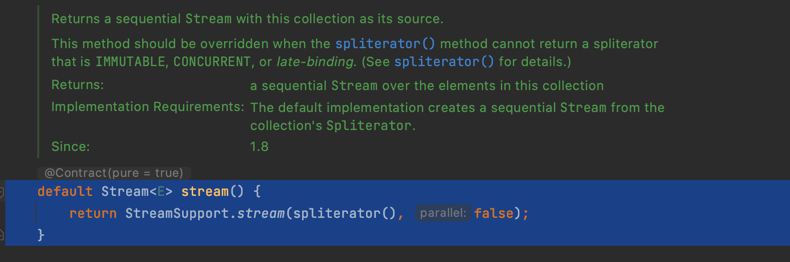
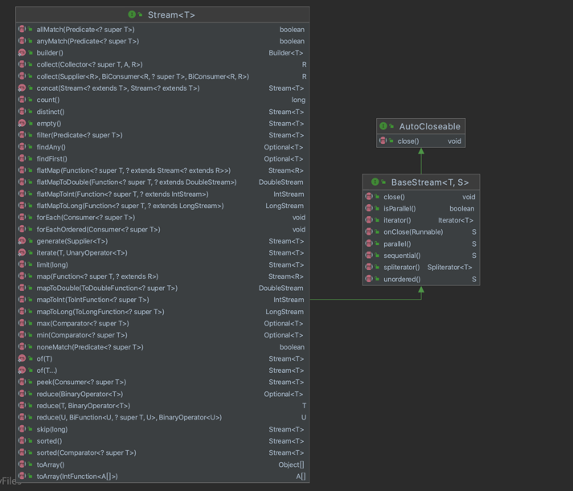
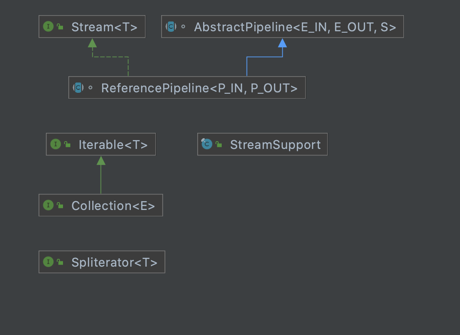
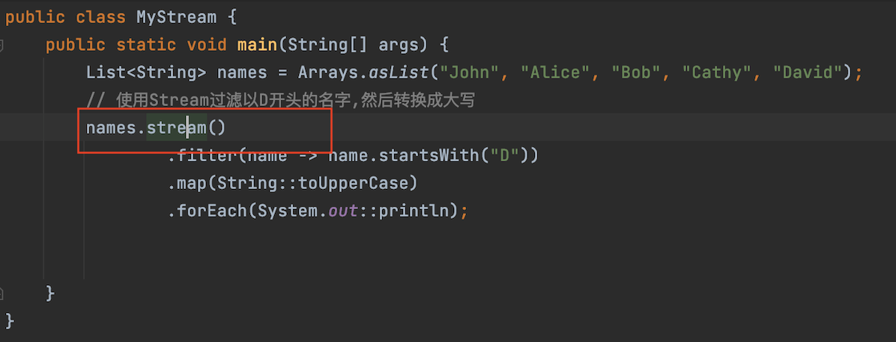
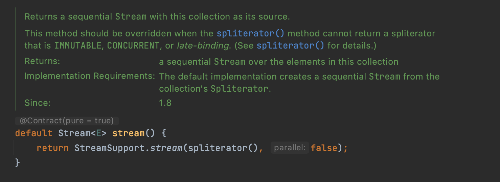
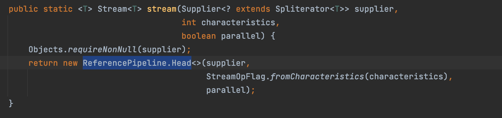
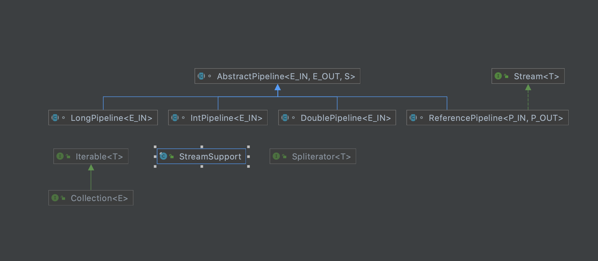

# Java8Stream模块
注：语雀Spring - (Spring框架解析 -- Spring-boot.jar -- Springboot的Context与listeners)  

本模块用于展示Java 8的新特性，也就是Stream处理方式，Stream处理不同于常见的
List、Map、Collection等容器，它存在以下5个特点。  
- 非集合：不会保存数据。
- 流水线处理：数据会以Stream的形式进行方法传递。
- 惰性求值：只有在需要时才会计算结果。
- 函数式编程：将函数（lambda表达式）作为参数传递下去。
- 并行处理：可以利用多核处理器进行计算

## 文件介绍:
- MyStream：展示java8的Stream的使用，一个简单的例子
- WhatStream：展示Stream都能做什么  
  + filter(Predicate<T> predicate)：根据提供的条件（谓词函数）筛选 Stream 中的元素。
  map(Function<T, R> mapper)：将 Stream 中的每个元素转换为另一种类型或值。
  + flatMap(Function<T, Stream<R>> mapper)：将每个元素转换为一个新的 Stream，然后将这些 Stream 连接成一个新的 Stream。它接受一个函数作为参数，这个函数接受一个类型为 T 的输入并返回一个类型为 R 的 Stream。通常，flatMap 用于处理嵌套的数据结构，例如将 Stream<Stream<T>> 转换为 Stream<T>。
  + distinct()：移除 Stream 中的重复元素。
  + sorted()：对 Stream 中的元素进行自然排序。
  + sorted(Comparator<T> comparator)：根据提供的比较器对 Stream 中的元素进行排序。
  + peek(Consumer<T> action)：对 Stream 中的每个元素执行一个操作，通常用于调试。
  终止操作会返回一个结果或执行一个副作用，这通常是对 Stream 中的元素进行聚合、搜索或其他处理。以下是一些常用的终止操作：
  + toArray()：将 Stream 转换为数组。
  + collect(Collector<T, A, R> collector)：将 Stream 中的元素收集到一个集合中，如 List、Set 或 Map。
  + count()：计算 Stream 中的元素数量。
  + forEach(Consumer<T> action)：对 Stream 中的每个元素执行一个操作。
  + reduce(BinaryOperator<T> accumulator)：使用给定的累加器将 Stream 中的元素合并成一个结果。
  + min(Comparator<T> comparator) 和 max(Comparator<T> comparator)：根据提供的比较器找到 Stream 中的最小值和最大值。
  + findFirst() 和 findAny()：查找 Stream 中的第一个元素或任意元素（通常用于并行流）。
  + anyMatch(Predicate<T> predicate)，allMatch(Predicate<T> predicate) 和 noneMatch(Predicate<T> predicate)：检查 Stream 中的元素是否满足给定的条件。
- StreamUseByContainer：证明Stream只能在容器类实例化的实体下使用，并分析他的设计模式
  
  这个函数的返回类型是Stream，他的结构图如下图所示，他继承了BaseStream
  
  
  
  如上图事例所示点击stream()函数后会跳转到Collection接口，然后调用下面函数
  
  再点击StreamSupport.stream()函数，会进入到StreamSupport类
  注释中对这个类的描述是"这个类主要是为库编写人员提供数据结构的流视图,面向最终用户的大多数静态流方法都在各种stream类中。"
  其中数据流视图是一种可以高效处理数据的结构，它允许开发者编写代码以声明性的方式对数据进行转换、过滤和其他操作。
  然后利用了数据流视图+管道设计模式的作用下让使用者将主要与各种具体的Stream类进行交互，这些类提供了静态方法，允许用户创建和操
  作数据流。这些方法通常设计得很直观，易于理解和使用，这样用户可以快速地进行开发，而不需要深入了解库的内部实现。
  
  然后这里返回了一个ReferencePipeline的元素，这个元素由于三部分组成，分别是Head、StatefulOp和StatelessOp，在创建类的时候，只用传入他的Head就可以了。
  当然除了ReferencePipeline元素以外，还有其他的类型，如下图所示。
  
  所以到目前位置就要掌握两个Java8函数编程的知识点：
  
  1、返回元素的结构和每个部分的作用
  ReferencePipeline是一个抽象类，用于实现大部分Stream API中的特性。它包含两个重要的内部抽象子类：Head和StatelessOp。
  
  下面是它的两个主要方法
  - ReferencePipeline.Head<E_IN, E_OUT>: 这是一个处理流源的抽象类。流源可以是集合、数组或者生成器函数等。Head实现了Stream<E_OUT>接口，为流提供了一系列中间操作和终端操作。
  - ReferencePipeline.StatelessOp<E_IN, E_OUT>: 这是一个处理无状态中间操作的抽象类。无状态操作是指操作的执行不依赖于任何之前的操作或者之后的操作。
  
  下面是每个抽象类的用途：  
    - ReferencePipeline：该类是一个抽象类，它实现了Stream接口，用于处理引用类型的数据流。引用类型的数据流可以包含任何类型的对象，比如String、Integer或者自定义类的对象。
    - LongPipeline：该类是ReferencePipeline的一个特化版本，用于处理long类型的数据流。它实现了LongStream接口，这个接口定义了一些特定于long类型的流操作。比如，LongStream有一个sum()方法，可以计算流中所有元素的和。
    - IntPipeline：该类与LongPipeline类似，只不过它处理的是int类型的数据流。它实现了IntStream接口，这个接口定义了一些特定于int类型的流操作。
    - DoublePipeline：同样，DoublePipeline类处理的是double类型的数据流，实现了DoubleStream接口。
  
  2、管道设计模式的结构和作用
   - 管道模式是一种设计模式，它是基于Unix中管道（pipeline）的概念，用于在一系列处理步骤之间传递数据。数据在管道中流动，每个阶段都对其进行处理。当数据从一个阶段移动到下一个阶段时，上一个阶段的输出将成为下一个阶段的输入。这种模式的好处在于，它支持并行操作，可以有效地用于解决大规模数据处理和传输的问题 
     代码PipelinePatternDemo是一个管道设计模式的例子，例子中用Function<T, R>接口实现了管道设计模式 
     下面是Function接口中定义的默认方法和静态方法：
     - compose(Function<? super V, ? extends T> before)：返回一个先执行参数函数，再执行当前函数的新的Function实例。
     - andThen(Function<? super R, ? extends V> after)：返回一个先执行当前函数，再执行参数函数的新的Function实例。
     - identity()：返回一个总是返回其输入参数的函数。
     
  
- ByLazyResult：展示惰性求值
  在计算机编程中，惰性求值是一种计算策略，只有在结果真正需要的时候才会对表达式进行求值。这种策略可以有效地避免不必要的计算，从而提高程序的性能。
  

  ① 什么是惰性求值，它有什么优点和缺点？
  
    这是一个基础的理论问题，你可以通过回答这个问题来展示你对惰性求值概念的理解。
    
    惰性求值是一种计算策略，只有在真正需要某个表达式的结果时，才对它进行求值。
    优点是可以提高程序的性能，特别是在处理大量数据时，可以避免不必要的计算，节省计算资源。
    缺点是可能会使程序的控制流程更复杂，也可能导致额外的内存开销，因为需要保存未计算的表达式。  

  ② 在Java 中如何实现惰性求值？
  
    这个问题可以用来测试你对Java 语言特性的理解，以及你能否灵活运用这些特性来实现特定的功能。 
    
    在 Java 中，可以通过使用 Java 8 的 Stream API 来实现类似惰性求值的效果。Stream 中的很多操作都是惰性的，
    例如 filter、map 等，这些操作并不会立即对所有元素进行处理，而是等到真正需要结果时
    （通常是在遇到一个终止操作，例如 collect、reduce、sum 等）才进行实际的计算。
  
  ③ 请举例说明 Java 8 的 Stream API 中哪些操作是惰性的，哪些操作是及早求值的？
    
    这个问题是用来测试你对 Java 8 的 Stream API 的理解程度，包括了对 Stream 中的各种操作以及它们的执行机制的理解。

    在 Java 8 的 Stream API 中，诸如 filter、map、flatMap、peek、skip 和 limit 等方法是惰性求值的，
    它们会返回一个新的 Stream，并不会立即进行处理。
    而 collect、toArray、reduce、min、max、count、anyMatch、allMatch、noneMatch、findFirst、findAny 等方法是及早求值的，
    它们会触发 Stream 的处理，并返回一个最终的结果。

  ④ 惰性求值在什么场景下可能会提高程序性能？

    这个问题是要测试你是否能理解并应用惰性求值这一编程技术以优化程序性能。

    在处理大量数据时，惰性求值可以避免对不必要的数据进行计算，因此可以提高程序性能。
    例如，如果你有一个包含上百万条数据的 Stream，并且你想找出其中的第一个满足某个条件的元素，通过惰性求值，
    你只需要对 Stream 中的元素进行处理直到找到满足条件的元素为止，而无需对所有元素都进行处理。
  
  ⑤ 对于一个包含大量元素的 Stream，如果我想找出其中的第一个满足某个条件的元素，我应该如何操作才能尽可能地提高程序性能？
    
    这个问题是要测试你是否能结合实际问题，灵活运用惰性求值以提高程序性能。
    
    应该使用 Stream API 提供的 filter 和 findFirst 方法。首先使用 filter 方法过滤出满足条件的元素，
    然后使用 findFirst 方法找出第一个满足条件的元素。这样，只要找到第一个满足条件的元素，处理过程就会立即停止，
    无需对所有元素都进行处理，从而提高程序性能。
    
    Optional<Integer> firstEven = stream.filter(i -> i % 2 == 0).findFirst();

    这段代码会在找到第一个偶数时就立即停止处理，而无需对 Stream 中的所有元素都进行处理。

- Parallel：展示多线程运行
  

  当你在处理大量数据或者执行复杂操作时，可以通过并行流（Parallel Stream）来利用多核处理器的能力，
  从而实现更快的数据处理。并行流通过底层的 ForkJoinPool 实现，将数据划分为多个部分，然后为每个部分分配一个处理线程，最后再将结果合并。

  要创建一个并行流，你可以直接使用 Collection 的 parallelStream 方法，或者将一个顺序流转换为并行流，
  例如：

    List<String> list = Arrays.asList("a", "b", "c", "d", "e");
    Stream<String> parallelStream = list.parallelStream();

  或者

    
    List<String> list = Arrays.asList("a", "b", "c", "d", "e");
    Stream<String> parallelStream = list.stream().parallel();

  并行流的操作和顺序流相同，但并行流在处理大数据量时，可能会比顺序流快很多。
  但是，并行流也不是万能的，它并不适用于所有情况，因为并行处理会引入额外的计算和内存开销，例如线程切换、结果合并等。
  因此，在使用并行流之前，你应该根据你的特定情况进行评估。如果你的任务主要是 I/O 操作，或者你的数据量不大，
  那么使用并行流可能不会有太大的性能提升，甚至可能会使得性能下降。

  以下是一些与并行流相关的面试问题：
  
  ① 什么是并行流，并行流和顺序流有什么区别？

    并行流是使用并发的方式处理数据，能够充分利用多核处理器的优势，而顺序流是单线程的，处理数据的方式是顺序的。

    并行流是利用多核处理器的优势，采用多线程并行处理的方式来执行数据操作。
    而顺序流则是单线程的，处理数据的顺序与数据的原始顺序相同。
    两者在使用方式上几乎相同，但在处理大数据量时，并行流能够更充分地利用系统资源，提高程序的运行速度。

  ② 如何创建并行流？
    
    
    见上

  ③ 并行流是如何工作的？
  
    并行流是基于 Java 7 中的 Fork/Join 框架实现的。它将一个大任务拆分成多个小任务进行并行处理，再将这些小任务的结果合并起来。这种方法充分利用了多核处理器的优势，提高了程序的运行效率。

  ④ 在什么情况下应该使用并行流？
  
    当你需要处理的数据量非常大，并且处理每个元素的时间相对较长，而且各个元素之间的处理没有相互依赖关系时，
    使用并行流通常可以获得更好的性能。然而，如果你的任务主要是 IO 密集型的，
    或者数据量不大，使用并行流反而可能会导致性能下降，因为线程切换和任务调度本身也会带来额外的开销。

  ⑤ 在并行流中如何保证线程安全？
  
    在使用并行流时，你应尽量避免使用状态依赖的操作，因为这会导致线程安全问题。
    如果你需要修改共享状态，应使用线程安全的数据结构或者使用 reduce 和 collect 方法，
    这些方法在设计时已经考虑了并行处理的情况。

  ⑥ 什么是 Fork/Join 框架？
    
    Fork/Join 是 Java 7 引入的一个用于并行执行任务的框架，是 ExecutorService 接口的一个实现。
    它通过将大任务拆分（fork）为若干个小任务，然后将这些小任务的结果合并（join）的方式，实现了并行处理任务的功能。