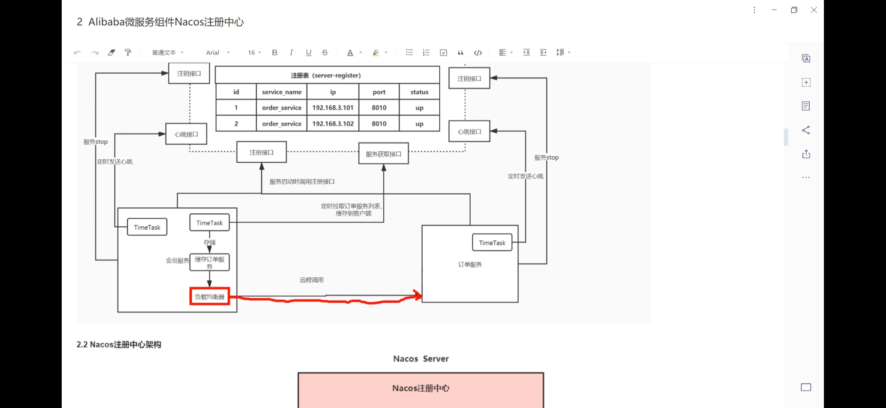
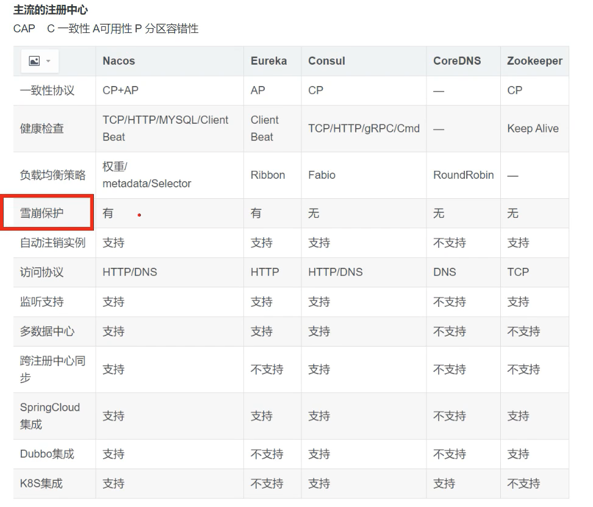
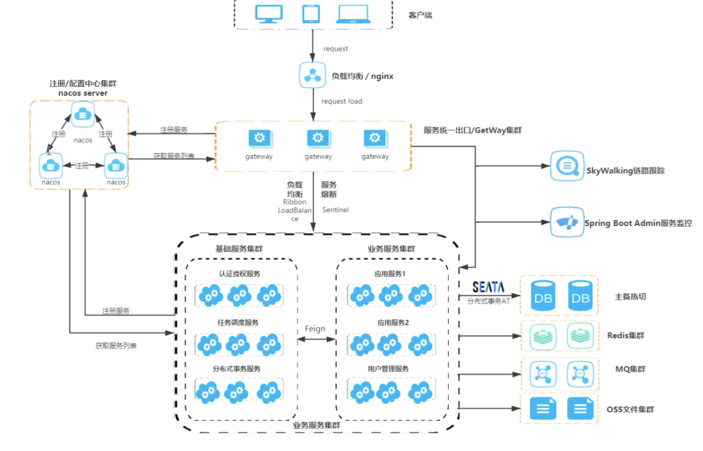

# SpringCloud学习
微服务网关的作用：
- 请求路由: Gateway 能将来自客户端的请求路由到对应的微服务。它根据请求的路径、方法等信息，决定将该请求转发到哪个微服务。

- 负载均衡: 在有多个实例的微服务环境中，Gateway 还可以对进入的请求进行负载均衡，有效地分发请求到各个微服务实例，以提高系统的整体性能和可用性。

- 服务聚合: Gateway 也可以将多个微服务的响应聚合成一个对客户端的响应，使得客户端无需单独和每个微服务通信，降低了复杂性。

- 认证和授权: Gateway 可以在请求进入微服务之前对其进行身份验证和授权，确保只有被授权的请求才能访问后端的微服务。

- 限流和熔断: 对于高流量的请求，Gateway 可以提供限流功能以保护后端的微服务。此外，如果某个服务出现故障，Gateway 还可以提供熔断机制，阻止对故障服务的请求，保护整个系统的稳定性。

- 缓存: Gateway 可以对某些请求的响应进行缓存，以减少对微服务的请求，提高系统的响应速度。

- 监控和日志: Gateway 可以记录请求和响应的详细信息，提供有价值的监控数据和日志，有助于故障排查和系统优化。

# Gateway网关

```
https://spring.io/projects/spring-cloud-gateway
```
gateway网关支持以下内容：
- 支持集成springmvc 5.0和spring boot 2.0
- 根据请求内容匹配路由
- 通过谓词工厂和过滤去可以定位到指定路有个
- 断路器集成
- 可以集成spring cloud Discovery客户端
- 通过配置就可以写谓词工厂和过滤器
- 访问限速
- 路径重写

##谓词工厂
谓词工厂的作用就是通过匹配请求包中不同的谓词来进入不同的路由。

### After Route Predicate 工厂
After Predicate工厂使用datetime字段匹配在指定日期时间之后发生的请求
```
spring:
  cloud:
    gateway:
      routes:
      - id: after_route
        uri: https://example.org
        predicates:
        - After=2017-01-20T17:42:47.789-07:00[America/Denver]
```
上面这个例子就是此路径匹配所有在2017年1月2日之后所有的请求。</br>
当然也有Before Predicate工厂，和After工厂的使用方法是一样的。</br>
也可以通过Between来匹配两个时间之中的请求。</br>
```
predicates:
 - Between=2017-01-20T17:42:47.789-07:00[America/Denver], 2017-01-21T17:42:47.789-07:00[America/Denver]
```
### Cookie Predicate工厂
也可以匹配Cookie Predicate工厂，此谓词匹配具有给定名称且其值与正则表达式匹配的 Cookie。
```
- Cookie=chocolate, ch.p
```

### Header Predicate工厂
```
- Header=X-Request-Id, \d+
```

### Host Route Predicate工厂
```
- Host=**.somehost.org,**.anotherhost.org
```
此功能还支持URI 模板变量，如{sub}.myhost.org
此谓词提取 URI 模板变量（如前面示例中定义的 sub）作为名称和值的映射，并使用 ServerWebExchangeUtils.URI_TEMPLATE_VARIABLES_ATTRIBUTE 中定义的键将其放置在 ServerWebExchange.getAttributes() 中。然后，这些值可供GatewayFilter工厂使用

### Method Route Predicate工厂
```
- Method=GET,POST
```

### 路径路由工厂
```
- Path=/red/{segment},/blue/{segment}
```
可以使用程序方法来访问配置中的变量。
```
Map<String, String> uriVariables = ServerWebExchangeUtils.getUriTemplateVariables(exchange);
String segment = uriVariables.get("segment");
```

### 访问路由工厂
可以通过访问变量来将请求分给不同路由,这里可以上传两个参数第一个参数是用来匹配请求变量，第二个参数用来撰写正则表达式
```
spring:
  cloud:
    gateway:
      routes:
      - id: query_route
        uri: https://example.org
        predicates:
        - Query=red, gree.

```
spring cloud gateway 提供了修改远程地址解析方式的功能，但是目前不知道其用法和目的
### 权重路由工厂
可以通过配置group和weight两个参数来设置权重，这里的权重是指流量的分配的权重
```
spring:
  cloud:
    gateway:
      routes:
      - id: weight_high
        uri: https://weighthigh.org
        predicates:
        - Weight=group1, 8
      - id: weight_low
        uri: https://weightlow.org
        predicates:
        - Weight=group1, 2
```
此路由会将 ~80% 的流量转发给 weighthigh.org，将 ~20% 的流量转发给 weighlow.org

###防火墙工厂
这可以与反向代理（如负载均衡器或 Web 应用程序防火墙）一起使用，其中仅当请求来自这些反向代理使用的受信任 IP 地址列表时，才应允许该请求。
```
spring:
  cloud:
    gateway:
      routes:
      - id: xforwarded_remoteaddr_route
        uri: https://example.org
        predicates:
        - XForwardedRemoteAddr=192.168.1.1/24
```
例如，如果 X-Forwarded-For 标头包含 192.168.1.10，则此路由匹配.

### 过滤工厂
这个相当于一个过滤器来过滤匹配的路由，工厂包括以下内容：
- AddRequestHeader： 这个过滤器可以将一个值添加到请求头中。它接受两个参数，一个是头的名字，另一个是值。
- AddResponseHeader： 与 AddRequestHeader 相似，但是是添加到响应头中。
- PrefixPath： 这个过滤器可以在请求的 URL 前面添加一个路径。
- RewritePath： 这个过滤器可以重写请求的 URL。
- Hystrix： 这个过滤器可以将请求封装在一个 Hystrix 命令中，提供断路器和线程隔离。
- Retry： 这个过滤器可以在请求失败时重试。
- SetPath： 这个过滤器用于设置请求的路径。
- SetStatus： 这个过滤器用于设置响应的 HTTP 状态码。
- StripPrefix： 这个过滤器用于从请求的 URL 中移除部分前缀。
- RequestRateLimiter： 这个过滤器用于限制请求的速率。
### 断路器与线程隔离
### 全局过滤器
- 全局过滤器和GatewayFilter的组合排序
以Bean的形式可以将全局过滤器加载到项目中，需要集成`GlobalFilter`, `Ordered`
- 网关指标过滤器
此项通过`spring.cloud.gateway.metrics.enabled`在配置文件中进行配置，如果配置为false则关闭
- 本地响应缓存过滤器
- 转发路由过滤器
- 网络路由过滤器
- 
  
### HttpHeaderFilter
### TLS和SSL
### 

# nginx + traefik作为网关
通常情况下也可以使用nginx + traefik替代gateway

# 负载均衡
## Ribbon
## Spring Cloud LoadBalancer
[Spring Cloud LoadBalancer官网地址](https://docs.spring.io/spring-cloud-commons/docs/current/reference/html/#spring-cloud-loadbalancer)

# Naco服务发现与服务注册
[Nacos线上手册](https://nacos.io/zh-cn/docs/console-guide.html) </br>
- 服务管理
  - 服务列表及服务健康状态展示
  - 服务元数据存储及编辑
  - 服务流量权重的调整
  - 服务优雅上下线
-  配置管理
   -  多种配置格式编辑
   -  编辑DIFF
   -  示例代码
   -  推送状态查询
   -  配置版本及一键回滚
-  命名空间
-  登录管理 


   
## 雪崩保护
`服务雪崩`是指在微服务架构中，一个或几个微服务由于网络延迟或者服务过载等原因导致服务变慢或者挂掉，从而引发连锁反应，使得整个系统的服务都受到影响，造成大规模服务瘫痪。
</br>
防止服务雪崩主要有以下措施：
- `超时控制和重试机制`为每个服务调用设置合理的超时时间，防止请求在网络中无限等待；同时设置合理的重试次数，防止服务暂时不可用时引发雪崩。
- `熔断器模式`当服务出现问题，如超时或错误率过高时，熔断器会"打开"，后续的请求会直接返回错误，而不是继续调用服务。这样可以防止问题扩散到其他服务。
- `限流`对访问频率过高的服务进行限流，保证服务的可用性。
- `负载均衡`通过负载均衡器将请求分散到多个服务实例，防止单个服务实例过载。
- `隔离`通过线程池、进程、容器等技术手段将服务隔离，防止一个服务的问题影响其他服务。

## 元数据
可以设置元数据，可以作为一个标识通过配合ribbon来设置服务调用的规则。
# 代码示例

```
SpringCloudLearn的Order是订单服务, GateWay是网关
```

