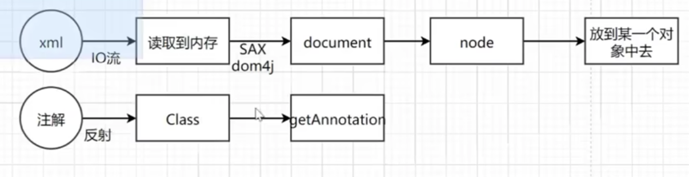
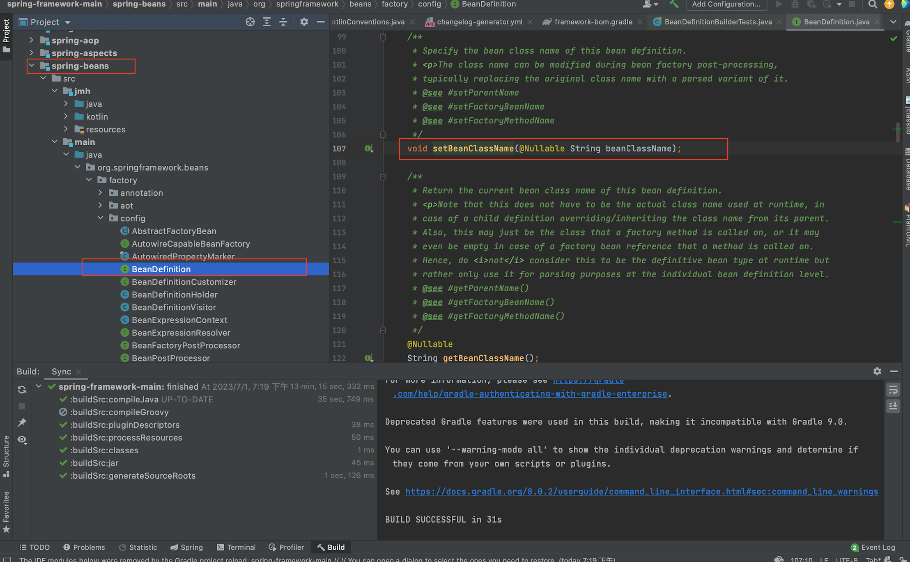
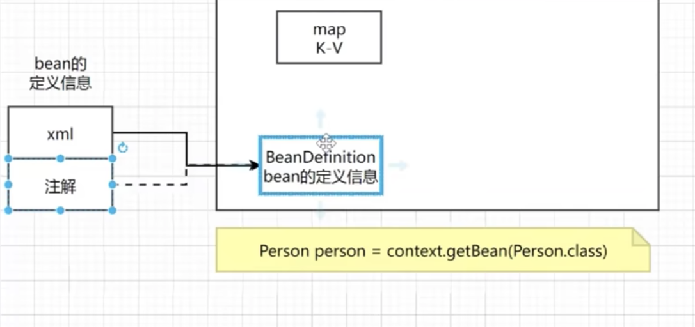
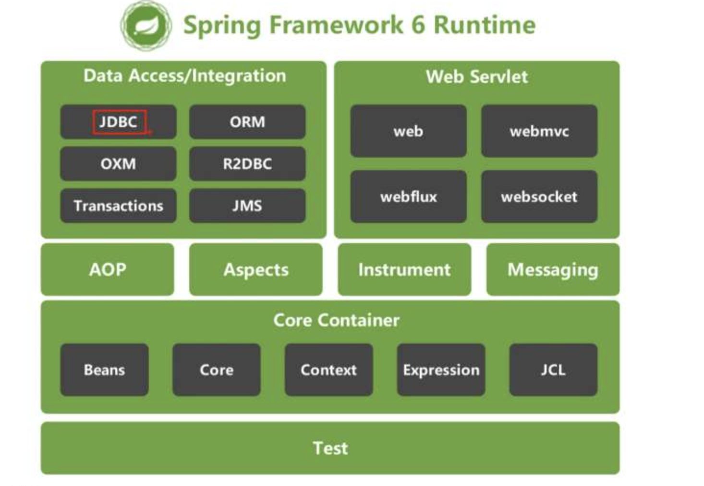
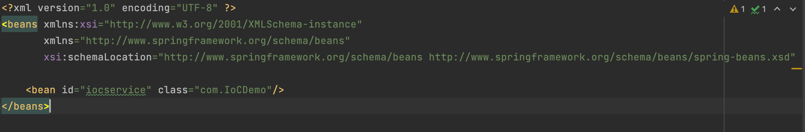
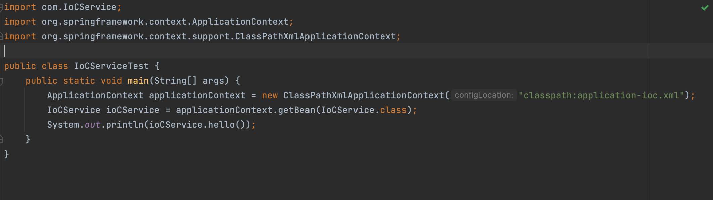
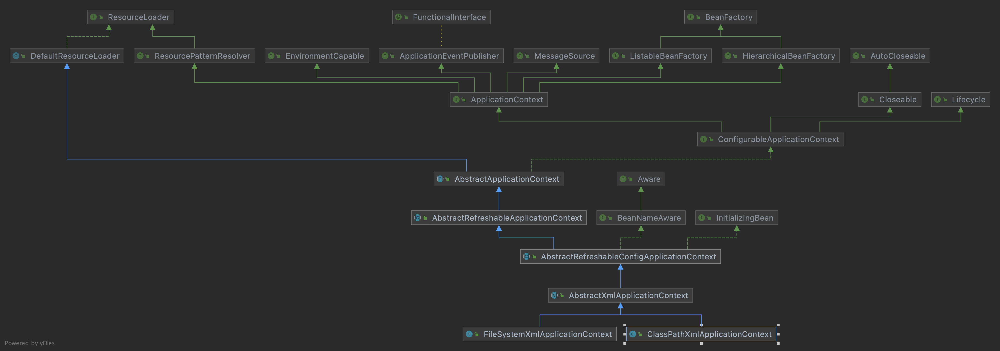

#Spring源码解读
对spring的认知：spring是一个基础的框架，同时他为我们提供了容器来装在基础的bean对象，之前在使用对象的时候需要去new，现在我只需要告诉框架我都用了那些对象，他会帮我们创建好，并且帮我们维护整体的生命周期，而且在spring基础之上还有springboot，springcloud良好的扩展技术栈，这些框架都是以spring框架为基石的
spring包括ioc,aop,ioc如何实现，生命周期，循环依赖

### Spring加载注解和配置文件
Spring可以通过容器获取类，所以里面是由于好多以K-V形式的map组成的，当获取获取一个类的时候

配置可以通过注解和配置文件的方式将类加载进堆中


如上图所示，从xml文件中读取类和从注解的形式中读取类，分别利用的两种方法。
读取后将类装载到容器中，这里的容器有一个map结构，这个map结构即使BeanDefinition,
用于Bean的定义信息,如下图所示，这是springframework中的源码，通过下面setBeanClassName等
方法的设置可以读取类的信息



### Spring源码的扩展性
在读取xml和注解的时候需要有一个接口来约束规范，这个接口就是BeanDefinitionReader,通过这个接口
可以通过这个接口对定义和读取bean的方法进行扩展。
注：接口与抽象类的区别（接口是自上而下的，抽象类是自上向下的）

接口扩展：BeanFactoryPostProcessor

反射基础代码:
```
1、获取Class对象

Class clazz = Class.forName("包名+类名");

Class clazz = 对象.getClass();

Class clazz = 类名.class;

2、获取构造器

Constructor ctor = clazz.getDeclaredConstructor();

3、创建对象

Object obj = ctor.newInstance();
```
Spring 模块介绍

framework-bom："Bill of Materials" - 一个特殊的 pom，可以让你在依赖管理中不必为每个单独的版本指定版本号。

framework-docs：包含所有的文档，例如参考手册，Javadoc 等。

<span style="color:red;">framework-platform</span>：提供了构建 Spring 应用程序的基础。

gradle：包含构建 Spring 框架所需的所有 Gradle 插件和脚本。

integration-tests：包含集成测试。

<span style="color:red;">spring-aop</span>：提供了面向切面编程的功能。

<span style="color:red;">spring-aspects</span>：包含了一些可以与 AspectJ 集成的类。

<span style="color:red;">spring-beans</span>：提供了创建、读取和管理 bean 的功能。

<span style="color:red;">spring-context</span>：为其他模块提供运行时环境。提供了框架式的事件处理、国际化和资源加载。

<span style="color:red;">spring-context-indexer</span>：为 Spring 提供了一种快速扫描组件的方法。

<span style="color:red;">spring-context-support</span>：为整个应用程序上下文提供支持。

<span style="color:red;">spring-core</span>：Spring Framework 的核心，包括 IoC 和 DI 功能。

spring-core-test：提供测试 Spring 应用程序所需的类和方法。

<span style="color:red;">spring-expression</span>：支持运行时查询和操作对象图，包含了 Spring 表达式语言 (SpEL) 的功能。

<span style="color:red;">spring-instrument</span>：提供了类检测和类转换的功能，通常用于性能监控。

<span style="color:red;">spring-jcl</span>：Spring 对 Commons Logging 的一个简单封装，用于日志管理。

<span style="color:red;">spring-jdbc</span>：提供了使用 JDBC 访问数据库的功能。

<span style="color:red;">spring-jms</span>：提供了使用 Java Message Service (JMS) 的功能。

<span style="color:red;">spring-messaging</span>：提供了消息驱动应用程序的基础设施，包括用于消息系统的简单的样板代码。

<span style="color:red;">spring-orm</span>：提供了对对象关系映射（ORM）工具的支持，如 JPA 和 Hibernate。

<span style="color:red;">spring-oxm</span>：提供了对象/XML 映射的抽象层。

<span style="color:red;">spring-r2dbc</span>：提供了对反应式 SQL 数据库连接的抽象层。

spring-test：提供了对 Spring 组件的集成测试的支持。

<span style="color:red;">spring-tx</span>：提供了编程式和声明式的事务管理。

<span style="color:red;">spring-web</span>：为基于 web 的应用程序提供基础设施，包括多文件上传功能。

<span style="color:red;">spring-webflux</span>：用于构建响应式 web 应用程序的模块。

<span style="color:red;">spring-webmvc</span>：包含 Spring 的模型视图控制器 (MVC) 和 REST Web 服务实现。

<span style="color:red;">spring-websocket</span>：提供了 WebSocket 功能，包括对 WebSocket 消息的发送和接收。

### Spring参考文档
https://github.com/shiyujun/spring-framework

https://mp.weixin.qq.com/s?__biz=MzU5MDgzOTYzMw==&mid=2247484640&idx=1&sn=41b813b09eb228343f7ac6c22dcc0f94&chksm=fe396edec94ee7c8485e6619ad18ed40c3645ccb7a1457aa81bfe8ac3e2cccc617b68b9f4fc5&scene=21#wechat_redirect

### Spring官方文档
- Spring Framework
  
  第一部分
   - Core Technologies
    
        这部分主要是讲解SpringFramework中的核心功能。
    
    1、IOC（Inversion of Control）
    2、AOP（Spring’s Aspect-Oriented Programming）
    3、AspectJ 的主要特性
    4、AOT与GraalVM
  

# Spring更新
| 版本       | 内容  | 
| :--------  | :-----  |
| Spring Framework 1.0 | 支持核心功能IOC. AOP </br> 内置支持Hibernate、 iBatis等第三方框架 <br> 对第三方技术简单封装。如：JDBC. Mail，事务等</br>只支持XML配置方式。|
| Spring Framework 2.0 | 最重费的变化：支持注解配置<br>增加对ehcache支持<br>对JMS (Java消息服务)，JMX (Java管理扩展）等支持|
| Spring Framework 3.0 | 支持Java类的配置<br>由原来的一个项目拆分成多个子模块。<br>添加单元测试子模块|
| Spring Framework 4.0 | 全面支持Java 8<br>添加二级子项目 Spring MVC，基于Servlet 3.0开发<br>提供WebSocket支持。<br>引入@RestController等注解，增强对Restful的支持。|
| Spring Framework 5.0 | 最低环境要求java 8<br>日志整合。把原来commons-logging 封装后交为Spring-jcl模块<br>跨域更改。把原来的JSONP支持变更为修政响应头的@CrossOrigin注解。<br>响应式编程。添加二级子项目WebFlux<br>使用Kotlin（科特林）进行函数式编程|
| Spring Framework 6.0 | 最低环境要求Java 17<br>加强对响应式编程支持。添加子模块spring-r2dbc<br>取消子模块spring-orm-hibernate4,只保留spring-orm,只支持Hibernate5.|


上面是SpringFramework 6的20个子模块

### 20个子模块的学习方法
1.这个模块是做什么的

2.模块的源码，画出脑图

3.模块的设计模式

4.使用模块

5.使用模块的场景

6.此模块与其他模块或类似项目的对比

#### 阅读spring farmework的源码是为了什么，读完之后记不住怎么办？
阅读 Spring Framework 的源代码有以下几个主要的原因：

更深入理解框架：通过阅读源代码，你可以更深入地理解 Spring Framework 的工作原理，包括依赖注入、AOP、事务管理等核心特性是如何实现的。

提升问题解决能力：当你在使用 Spring Framework 遇到问题时，如果你对源代码有足够的理解，你就更有可能找到问题的原因和解决方法。

学习优秀的代码实践：Spring Framework 是由一组经验丰富的开发者编写的，他们的代码遵循最佳实践，因此阅读他们的代码可以帮助你学习如何编写高质量的代码。

如果你阅读源代码后发现自己记不住，那么完全没有必要担心。记住源代码并不是目标，理解是关键。以下是一些建议：

注重理解，而非记忆：试图记住每一行代码并不实际，重要的是理解代码的工作原理和设计模式。如果你遇到了不理解的代码，可以使用搜索引擎或者问答网站如 StackOverflow 来寻找答案。

动手实践：理解了代码后，尝试自己编写一些小程序来应用你学到的知识。实践是最好的记忆方法。

编写注释和笔记：当你阅读代码时，记下你的理解和问题。这些笔记在以后会非常有用，它们可以帮助你回顾和深化你的理解。

分步阅读：不需要一次性就完全理解 Spring Framework 的全部代码。可以从你最熟悉或最感兴趣的部分开始，然后逐渐扩大阅读范围。

多次阅读：一次阅读可能无法理解所有的内容，多次阅读可以帮助你更好地理解和记忆。

参与社区：Spring Framework 有一个活跃的开发者社区，你可以在那里找到很多关于源代码的讨论和解释。参与这些讨论也是学习的一个好方式。

阅读源代码是一个长期的过程，不要期待一夜之间就能看懂所有的内容。持续学习和实践，你会逐渐看到进步。

## Spring IOC源码分析
### 预备知识
- `ClassPathXmlApplicationContext`

示例代码在SpringDemo,首先在IoCService中定下了一个标准，然后IoCDemo实现了这个接口，在application-ioc.xml中定义了bean配置。

然后再IoCServiceTest中可以通过ClassPathXmlApplicationContext来加载配置文件中的bean,<span style="color:red;">Spring faremwork就是通过这个方法加载的配置文件中的Bean</span>,所以首先要认识ClassPathXmlApplicationContext这个方法。



下面是类的作用

1、ClassPathXmlApplicationContext：
```
public class ClassPathXmlApplicationContext extends AbstractXmlApplicationContext {

	@Nullable
	private Resource[] configResources; // 存放资源文件,看来加载bean的方式有两种，第一种是是通过setConfigLocations读取配置文件加载，第二种是直接通过class文件加载
	...
	public ClassPathXmlApplicationContext( // #1
			String[] configLocations, boolean refresh, @Nullable ApplicationContext parent)
			throws BeansException { // 主要方法一：通过配置文件加载bean

		super(parent);
		setConfigLocations(configLocations);
		if (refresh) {
			refresh();
		}
	}
	...
	public ClassPathXmlApplicationContext(String[] paths, Class<?> clazz, @Nullable ApplicationContext parent)
			throws BeansException { // 主要方法二：通过class加载bean

		super(parent);
		Assert.notNull(paths, "Path array must not be null");
		Assert.notNull(clazz, "Class argument must not be null");
		this.configResources = new Resource[paths.length];
		for (int i = 0; i < paths.length; i++) {
			this.configResources[i] = new ClassPathResource(paths[i], clazz);
		}
		refresh();
	}
	...

}
```
2、FileSystemXmlApplicationContext：
`FileSystemXmlApplicationContext`类是Spring框架中的一个类，主要用于加载Spring应用上下文的配置文件，并创建Spring应用上下文对象。

```
 FileSystemXmlApplicationContext和ClassPathXmlApplicationContext的区别
 
 FileSystemXmlApplicationContext是通过文件系统的路径来查找配置文件的。
 例如，你可以将配置文件放在项目的某个目录中，然后使用FileSystemXmlApplicationContext类的构造方法加载这个配置文件，
 例如：
 ApplicationContext ctx = new FileSystemXmlApplicationContext("/path/to/your/xml/file.xml");

 ClassPathXmlApplicationContext是通过类路径（classpath）来查找配置文件的。
 类路径是JVM用来查找类文件和资源文件的一个参数。
 当你使用ClassPathXmlApplicationContext时，Spring将在类路径下查找配置文件，
 例如：
 ApplicationContext ctx = new ClassPathXmlApplicationContext("file.xml");

 总结来说，FileSystemXmlApplicationContext和ClassPathXmlApplicationContext的主要区别在于它们查找配置文件的方式不同：一个是通过文件系统的路径，一个是通过类路径。你可以根据你的配置文件的位置选择使用哪一个。
 
```

```
public class FileSystemXmlApplicationContext extends AbstractXmlApplicationContext {
	...
	public FileSystemXmlApplicationContext(
			String[] configLocations, boolean refresh, @Nullable ApplicationContext parent)
			throws BeansException {

		super(parent);
		setConfigLocations(configLocations);
		if (refresh) {
			refresh();
		}
	}
	...

}
```
上述代码中用到了`setConfigLocations`来解析,setConfigLocations方法的主要工作有两个：

1、创建环境对象ConfigurableEnvironment

2、处理ClassPathXmlApplicationContext传入的字符串中的占位符

点击进入setConfigLocations中, 进入到`AbstractRefreshableConfigApplicationContext.java`中

```
    /*
	* 设置此应用程序上下文的配置位置。 <p>如果未设置，实现可能会酌情使用默认值。
	* */
	public void setConfigLocations(@Nullable String... locations) {
		if (locations != null) {
			Assert.noNullElements(locations, "Config locations must not be null");
			this.configLocations = new String[locations.length];
			for (int i = 0; i < locations.length; i++) {
				this.configLocations[i] = resolvePath(locations[i]).trim();
			}
		}
		else {
			this.configLocations = null;
		}
	}
```
然后里面有调用`resolvePath`方法，点击进入`resolvePath`，目前还在`AbstractRefreshableConfigApplicationContext.java`中
```
    /*
    * 解析给定路径，如有必要，用相应的环境属性值替换占位符。应用于配置位置。 
    * @param path 原始文件路径 @return 解析后的文件路径
    */
	protected String resolvePath(String path) {
		return getEnvironment().resolveRequiredPlaceholders(path);
	}
```
点击进入`getEnvironment`,进入到`AbstractApplicationContext.java`中
```
	public ConfigurableEnvironment getEnvironment() {
		if (this.environment == null) {
			this.environment = createEnvironment();
		}
		return this.environment;
	}
```
再点击进入`createEnvironment`进入到`AbstractApplicationContext.java`，此方法创建并返回一个新的StandardEnvironment。子类可以重写此方法以提供
```
	protected ConfigurableEnvironment createEnvironment() {
		return new StandardEnvironment();
	}
```
点击进入`StandardEnvironment.java`，里面有`customizePropertySources`方法，此方法会往资源列表中添加`Java进程中的变量`和`系统的环境变量`。
```
public class StandardEnvironment extends AbstractEnvironment {
	/** System environment property source name: {@value}. */
	public static final String SYSTEM_ENVIRONMENT_PROPERTY_SOURCE_NAME = "systemEnvironment";
	
	/** JVM system properties property source name: {@value}. */
	public static final String SYSTEM_PROPERTIES_PROPERTY_SOURCE_NAME = "systemProperties";
	
	public StandardEnvironment() {}
	
	protected StandardEnvironment(MutablePropertySources propertySources) {super(propertySources);}
	
	@Override
	protected void customizePropertySources(MutablePropertySources propertySources) {
		propertySources.addLast(
				new PropertiesPropertySource(SYSTEM_PROPERTIES_PROPERTY_SOURCE_NAME, getSystemProperties()));
		propertySources.addLast(
				new SystemEnvironmentPropertySource(SYSTEM_ENVIRONMENT_PROPERTY_SOURCE_NAME, getSystemEnvironment()));
	}

}
```


3、AbstractXmlApplicationContext:
4、AbstractRefreshableConfigApplicationContext:
5、InitializingBean:
6、BeanNameAware
7、Aware
8、AbstractRefreshableApplicationContext：
9、AbstractApplicationContext
10、ConfigurableApplicationContext
11、ApplicationContext
12、Closeable
13、Lifecycle
14、DefaultResourceLoader
15、ResourcePatternResolver
16、EnvironmentCapable
17、ApplicationEventPublisher
18、MessageSource
19、ListableBeanFactory
20、HierarchicalBeanFactory
21、AutoCloseable
22、ResourceLoader
23、Functionallnterface
24、BeanFactory